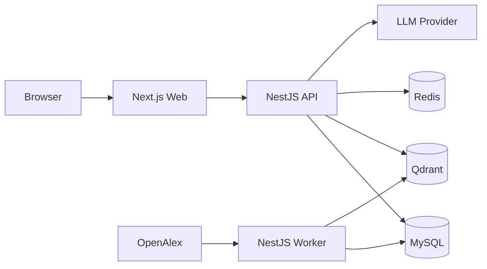
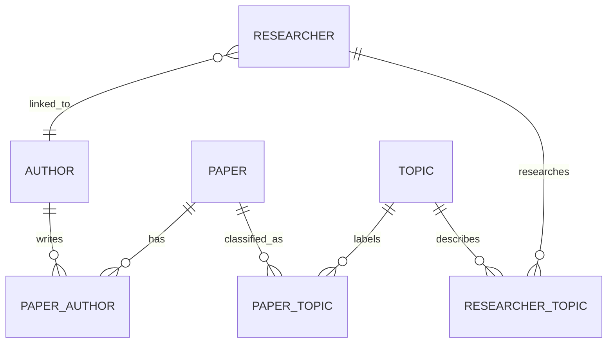
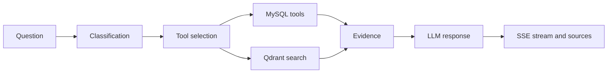

# UIUC Research Portal — Presentation Outline

## Slide 1 — UIUC Research Portal

Researcher discovery, publication search, and an evidence-based AI assistant

**Presented by:** [Your name]  
**Course / supervisor:** [Course or supervisor]  
**Date:** [Presentation date]

`[Image placeholder: Homepage screenshot showing the university header, researcher section, and chat launcher.]`

---

## Slide 2 — Original task

The assignment requested a one-page research portal for the University of Illinois Urbana-Champaign.

### Data requirements

- Import the top 10,000–20,000 UIUC papers from the latest two years through OpenAlex.
- Use the supplied list of approximately 1,000 faculty members with names and keywords.
- Collect supporting institution information such as its location and images.

### Application requirements

- Build the main portal interface and supporting backend.
- Build a basic LLM assistant for questions about recent research, notable papers, and institutional focus areas.

### Evaluation focus

- Frontend and backend implementation
- UI and UX quality
- Independent use of the OpenAlex API
- Ability to learn LLM and academic data concepts

`[Image placeholder: One-page summary of the supplied task, with small references to Illinois Institution Profile, Illinois Experts, OpenAlex, and the faculty dataset.]`

---

## Slide 3 — Dataset scope decision

The original 10,000–20,000 paper requirement provides a manageable recent-publication sample, but it does not fully support researcher profiles or many natural questions.

### Limitation of the original scope

- A two-year subset omits older and highly cited work.
- A global paper limit gives uneven coverage across researchers.
- Publication counts would describe only the imported subset, not each researcher’s actual OpenAlex record.
- Questions such as “How many papers does this researcher have?” or “What is their most cited paper?” could produce incomplete answers.

### Implemented scope

- The system first linked the supplied researchers to verified OpenAlex Authors.
- It then fetched the complete publication history of every confirmed Author with cursor pagination.
- It synchronized paper metadata, citation counts, authorships, and topics instead of stopping at 10,000–20,000 recent papers.

This decision increased the current dataset to **210,573 unique papers** and made researcher-level search and assistant answers more complete.

`[Image placeholder: Comparison diagram. Left: original scope with 10,000–20,000 recent UIUC papers. Right: verified Researchers connected to their complete OpenAlex publication histories.]`

**Presenter note:** The wider dataset is an implementation decision made to support the expected questions more accurately. The portal can still filter results by the original two-year period when required.

---

## Slide 4 — Implemented features

- Search and filter researchers by name, department, and research topic
- Open researcher profiles through readable slug URLs
- View research topics, publication metrics, and complete paper lists
- Search papers by title within each researcher profile
- Explore institution publication statistics and topic trends
- Ask questions through an AI assistant with streaming answers and sources
- Continue follow-up questions using the previous conversation context

`[Image placeholder: Three screenshots showing the researcher directory, a researcher profile, and the AI assistant.]`

---

## Slide 5 — Development process

1. Built the web interface and researcher directory.
2. Imported the faculty dataset and OpenAlex records.
3. Linked each Researcher to the correct OpenAlex Author.
4. Re-synchronized complete papers, citations, and topics.
5. Added local embeddings and Qdrant semantic search.
6. Added question classification, data tools, and streamed LLM responses.
7. Added rate limits, credential fallback, resumable jobs, and diagnostic logs.

`[Image placeholder: Short horizontal timeline with the seven implementation stages.]`

---

## Slide 6 — System architecture

- **Web:** Next.js, React, TanStack Query, and SSE client
- **API:** NestJS REST endpoints, chat orchestration, retrieval, and security
- **Worker:** OpenAlex imports, data reconciliation, and vector synchronization
- **MySQL:** Canonical researcher, author, paper, topic, and operational data
- **Qdrant:** Paper vectors used for semantic retrieval
- **Redis:** Rate limiting, caching, and concurrency control



`[Image placeholder: Render the Mermaid diagram as the main visual.]`

---

## Slide 7 — Project structure

| Path | Responsibility |
| --- | --- |
| `apps/web` | Portal pages, search, researcher profiles, and assistant UI |
| `apps/api` | REST and SSE API, AI flow, data retrieval, and security |
| `apps/worker` | OpenAlex imports, reconciliation, and vector jobs |
| `packages/database` | Prisma schema, migrations, and database client |
| `packages/openalex` | OpenAlex client, pagination, normalization, and retry logic |
| `packages/embeddings` | Shared local E5 embedding function |
| `packages/contracts` | Shared request, response, pagination, and chat types |
| `packages/ui` | Reusable UI components |

The project uses a pnpm and Turborepo monorepo so all applications share types and libraries.

`[Image placeholder: Repository tree expanded to the apps and packages levels.]`

---

## Slide 8 — Database structure

### Main entities

- `Researcher` stores the curated university profile.
- `Author` stores the OpenAlex bibliographic identity.
- `Paper` stores publication metadata and citation counts.
- `Topic` stores OpenAlex research topics.

### Main relationships

- `Researcher.authorId` links a profile to its verified Author.
- `PaperAuthor` creates the many-to-many relationship between Authors and Papers.
- `PaperTopic` links Papers to Topics.
- `ResearcherTopic` stores the complete topic set derived from a researcher’s works.

### Operational tables

- `ImportRun` stores cursor progress and import status.
- `EmbeddingRecord` tracks vector synchronization.
- `ChatRequest` stores chat results, citations, and latency.
- `AiCredential` stores encrypted provider credentials and fallback priority.



`[Image placeholder: Render the simplified ER diagram.]`

---

## Slide 9 — OpenAlex data pipeline

1. Read the curated researcher list and verified OpenAlex Author IDs.
2. Fetch all Author works with cursor pagination.
3. Normalize papers, authors, topics, dates, abstracts, and citation counts.
4. Upsert records by stable OpenAlex IDs to avoid duplicates.
5. Rebuild paper-author and researcher-topic relationships.
6. Save the cursor and counters so interrupted jobs can resume.
7. Queue new or changed papers for vector synchronization.

```text
GET /works
?filter=authorships.author.id:A...
&per_page=100
&cursor=*
```

`[Image placeholder: Pipeline diagram showing Researcher list and OpenAlex, followed by normalization, MySQL, embedding, and Qdrant.]`

---

## Slide 10 — Identity and data reconciliation

`Researcher` stores the university profile, while `Author` represents an OpenAlex bibliographic identity.

Author matching handles initials, middle names, preferred names, reordered tokens, punctuation, compound surnames, email evidence, UIUC affiliation, and candidate collisions. Ambiguous matches use a manually reviewed `real_id`.

Examples:

- Amy Jaye Wagoner Johnson matched Amy J. Wagoner Johnson
- Theresa Ann Saxton-Fox matched Theresa Saxton-Fox
- Kevin Chenchuan Chang matched Kevin Chen-Chuan Chang

After confirmation, the worker fetches the Author’s complete works and aggregates topics across those works. It does not rely on the five headline topics in the OpenAlex Author object.

`[Image placeholder: One Researcher connected to its verified OpenAlex Author, papers, and full topic set.]`

---

## Slide 11 — Vector search

The worker generates paper embeddings locally with `Xenova/multilingual-e5-small`.

- Input includes the title, primary topic, and available abstract.
- Each vector has 384 dimensions and uses cosine similarity.
- Qdrant collection: `uiuc_papers_e5_v1`
- MySQL remains the canonical database.
- `EmbeddingRecord` returns failed or outdated vectors to `PENDING`.

For semantic search, the API embeds the question with the same model, retrieves the nearest paper vectors, and loads the complete records from MySQL.

`[Image placeholder: Question and paper text passing through the same embedding model, followed by Qdrant nearest-neighbor search.]`

---

## Slide 12 — AI answer flow

1. **Classification:** Extract intent, researcher, topic, filters, and result limit.
2. **Tool selection:** Select from an allowlisted set of application tools.
3. **Retrieval:** Use MySQL for exact facts and Qdrant for semantic evidence.
4. **Generation:** Provide the LLM with bounded history, facts, and evidence.
5. **Streaming:** Send response tokens to the browser through SSE.
6. **Sources:** Display only records that support the answer.



`[Image placeholder: Render the AI flow diagram beside a sourced assistant answer.]`

---

## Slide 13 — Reliability and security

- DTO validation, input limits, and controlled CORS origins
- Redis rate limits and concurrent stream limits
- Early `429` or `503` responses before expensive calls
- Encrypted API credentials with fallback, cooldown, and circuit breaking
- OpenAlex retries, cursor checkpoints, and resumable imports
- Request IDs and logs for classification, retrieval, and generation
- Signed anonymous sessions and hashed Redis identifiers

`[Image placeholder: Compact request flow showing validation, rate limiting, retrieval, provider fallback, and response.]`

---

## Slide 14 — Current result and demonstration

| Metric | Result |
| --- | ---: |
| Researchers | 999 |
| Linked OpenAlex Authors | 995 |
| Unresolved Researchers | 4 |
| Papers | 210,573 |
| Authors and co-authors | 342,637 |
| Topics | 4,348 |
| Researcher-topic links | 118,528 |
| Completed embeddings | 173,937 |
| Pending embeddings | 36,636 |

### Live demonstration

1. Search for a researcher and open the profile.
2. Search and sort the researcher’s papers.
3. Ask for an exact publication count.
4. Ask a follow-up about a recent or highly cited paper.
5. Show the streamed response and supporting sources.

`[Image placeholder: Portal homepage or a short demo storyboard.]`
