# UIUC Research Portal System Architecture

Last reviewed: 28 September 2026

## 1. Purpose and scope

This document describes the implemented architecture of the UIUC Research Portal. It is intended as a technical reference for reports, demonstrations, maintenance, and deployment planning.

It covers:

- the monorepo and runtime applications;
- the relational and vector data models;
- OpenAlex acquisition, normalization, identity resolution, and reconciliation;
- local embedding generation and Qdrant synchronization;
- the intent-classification, tool-execution, and LLM response pipeline;
- browser and server conversation persistence;
- provider fallback, traffic admission, rate limiting, and security controls;
- operational commands, data invariants, limitations, and completion criteria.

The document deliberately separates architecture from operational state. A feature may be implemented even while its background synchronization job is incomplete.

## 2. Current operational snapshot

The following values were read directly from MySQL and Qdrant on 28 September 2026.

| Metric                         |       Current value | Meaning                                                                     |
| ------------------------------ | ------------------: | --------------------------------------------------------------------------- |
| Institution records for UIUC   |                   1 | Current OpenAlex institution profile is stored in MySQL                     |
| OpenAlex institution works     |             338,931 | Institution-level OpenAlex metric, not the local paper count                |
| OpenAlex institution citations |          33,374,522 | Institution-level OpenAlex cited-by metric                                  |
| Researchers                    |                 999 | Curated portal researcher profiles                                          |
| Researchers linked to Authors  |                 988 | Profiles with a canonical `Researcher.authorId`                             |
| Researchers without Authors    |                  11 | Explicitly unresolved profiles; automatic guessing is intentionally avoided |
| Authors                        |             263,035 | All normalized bibliographic authors and co-authors                         |
| Papers                         |             147,810 | Canonical paper records in MySQL                                            |
| Topics                         |               4,305 | Normalized OpenAlex topics                                                  |
| Embeddings completed           |             141,480 | MySQL ledger rows successfully synchronized to Qdrant                       |
| Embeddings pending             |               6,330 | Papers waiting for local embedding and Qdrant upsert                        |
| Qdrant points                  |             141,480 | Matches the completed embedding ledger                                      |
| Qdrant collection              | `uiuc_papers_e5_v1` | 384-dimensional cosine collection, status green                             |

The latest full `openalex_researcher_works` import run is still marked `FAILED`. It persisted 123,992 fetched works before OpenAlex returned HTTP 429. The system must therefore not claim that every researcher publication set is fully reconciled, even though the stored dataset and vector index are usable.

## 3. Architectural principles

The implementation follows these rules:

1. **MySQL is canonical.** Qdrant is a derived semantic index and can be rebuilt.
2. **Researcher and Author are different entities.** A curated faculty profile is not the same as a bibliographic identity.
3. **Identity resolution may remain unresolved.** Ambiguity is recorded instead of forcing a potentially incorrect match.
4. **Imports are idempotent and resumable.** OpenAlex IDs, unique relations, and `ImportRun` checkpoints prevent duplicate data and allow recovery.
5. **Vector synchronization is explicit.** `EmbeddingRecord` is both the queue and synchronization ledger.
6. **LLMs do not receive database access.** The model classifies a request and generates the final response; deterministic application code selects and executes allowlisted tools.
7. **Structured facts and semantic evidence are separate.** Counts and metadata come from MySQL; conceptual paper retrieval comes from Qdrant.
8. **Sources are evidence-derived.** A response without relevant paper evidence must not display unrelated citations.
9. **Expensive work is rejected early.** Validation, rate limits, and concurrency leases execute before vector search or provider calls.
10. **Secrets never leave the API.** Provider keys are encrypted at rest and only decrypted for an outbound provider attempt.

## 4. System context

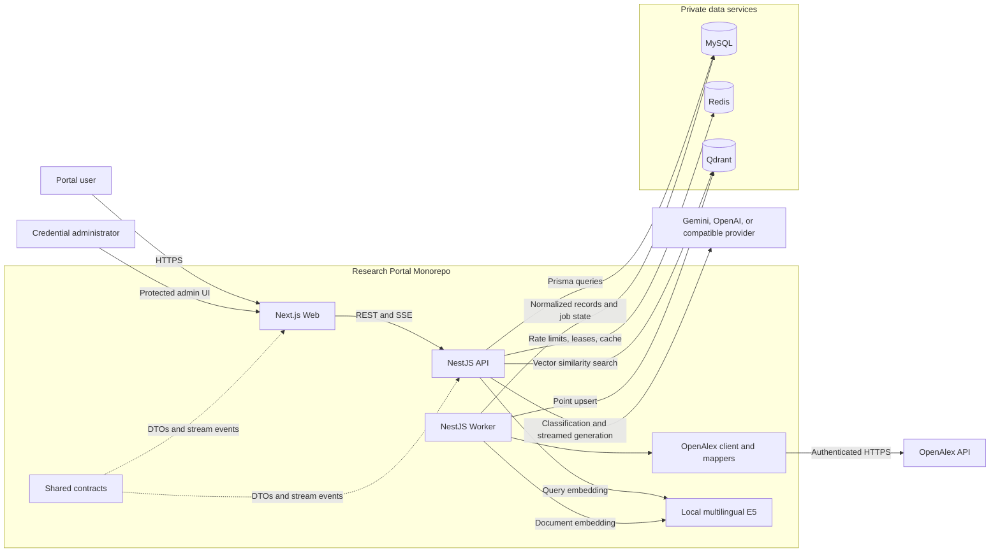

## 5. Repository structure

| Path                  | Technology                                   | Responsibility                                                                                                                                                       |
| --------------------- | -------------------------------------------- | -------------------------------------------------------------------------------------------------------------------------------------------------------------------- |
| `apps/web`            | Next.js App Router, React 19, TanStack Query | Public portal, institution overview, searchable researcher directory, researcher profiles, paper presentation, persistent SSE assistant, and provider administration |
| `apps/api`            | NestJS                                       | REST/SSE boundary, validation, security, structured retrieval, semantic retrieval, conversation orchestration, provider adapters, and encrypted credentials          |
| `apps/worker`         | NestJS application context                   | Institution sync, OpenAlex imports, researcher identity linking, complete author-work scans, metric reconciliation, local embeddings, and Qdrant synchronization     |
| `packages/database`   | Prisma, MariaDB adapter, MySQL               | Schema, generated client, seed data, migrations, and shared database utilities                                                                                       |
| `packages/contracts`  | TypeScript                                   | Shared DTOs, pagination types, chat events, citations, and provider credential contracts                                                                             |
| `packages/openalex`   | TypeScript                                   | OpenAlex authentication, URL construction, retries, cursor pagination, normalization, and abstract reconstruction                                                    |
| `packages/embeddings` | Transformers.js compatible runtime           | Shared local `Xenova/multilingual-e5-small` document and query embeddings                                                                                            |
| `packages/ui`         | Shared React components                      | Accessible reusable UI primitives including the combobox                                                                                                             |
| `docker`              | Docker Compose                               | Local MySQL, Redis, Qdrant, and optional administration tools                                                                                                        |

## 6. Runtime component map

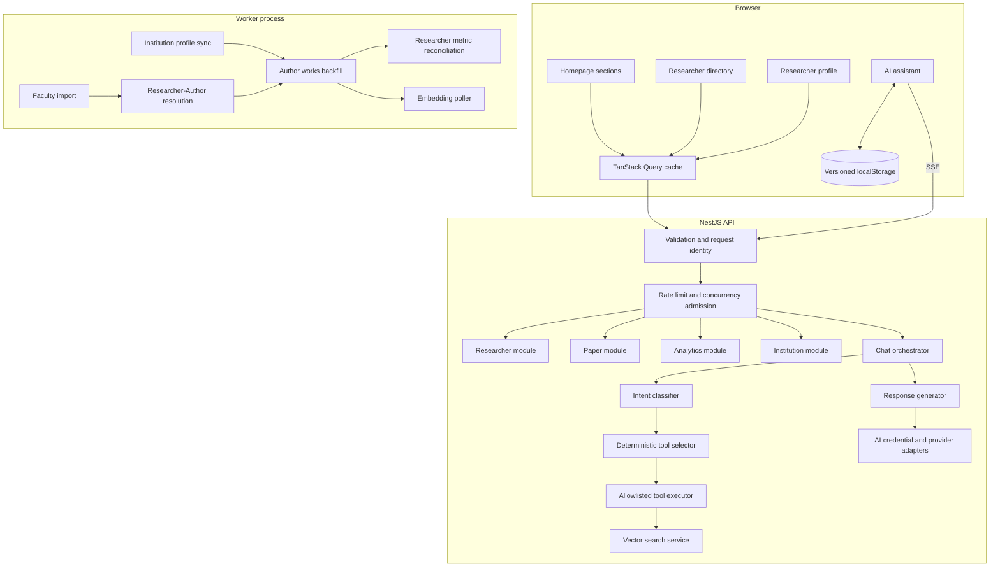

### 6.1 Web modules

| Component                 | Responsibility                                                                                                                             |
| ------------------------- | ------------------------------------------------------------------------------------------------------------------------------------------ |
| `app/page.tsx`            | Composition-only homepage; feature state is owned by child components                                                                      |
| `ResearcherDirectory`     | Researcher query, pagination, department selection, and TanStack Query lifecycle                                                           |
| `ResearcherSearch`        | Plain debounced text search; topic aliases are expanded only by the backend                                                                |
| `DepartmentFilter`        | Searchable combobox backed by the department endpoint                                                                                      |
| Researcher profile route  | Slug-based routing, profile metadata, activity totals, title search, paginated publications, and external-profile labeling                 |
| `UniversityOverview`      | Institution introduction, full-bleed statistics band, and campus links                                                                     |
| `AiAssistant`             | Persistent conversation state, minimize/open animation, thinking state, SSE streaming, cancellation, error rendering, and citation display |
| `AssistantMessageContent` | Safe lightweight formatting for bold text, inline code, headings, and list items without executing arbitrary HTML                          |
| `researchApi`             | Typed REST/SSE browser client                                                                                                              |
| `QueryProvider`           | TanStack Query provider for server state                                                                                                   |

### 6.2 API modules

| Module       | Responsibility                                                                                                   | Primary endpoints                                                |
| ------------ | ---------------------------------------------------------------------------------------------------------------- | ---------------------------------------------------------------- |
| Database     | Prisma connection lifecycle                                                                                      | Internal                                                         |
| Institution  | Current UIUC identity, geography, and OpenAlex metrics with a safe fallback                                      | `GET /v1/institution`                                            |
| Analytics    | Totals and publication/topic trends                                                                              | `GET /v1/stats`, `/v1/trends`, `/v1/topics`                      |
| Researchers  | Search, topic-alias expansion, departments, slug resolution, and paginated author-linked papers                  | `GET /v1/researchers`, `/departments`, `/:slug`, `/:slug/papers` |
| Papers       | Search, filters, sorting, pagination, and paper details                                                          | `GET /v1/papers`, `/:id`                                         |
| Vector       | Local query embedding and Qdrant retrieval                                                                       | Internal                                                         |
| Chat         | History loading, classification, tool orchestration, evidence merging, response generation, SSE, and persistence | `POST /v1/chat`, `/v1/chat/stream`                               |
| AI Providers | Encrypted credential vault, provider adapters, ordered fallback, cooldown, and circuit breaker                   | `/v1/admin/ai-credentials`                                       |
| Security     | Session identity, IP hashing, validation, rate limits, distributed leases, headers, and caching                  | Global guards/interceptors                                       |
| Health       | Liveness and readiness                                                                                           | `/health`, `/health/live`, `/health/ready`                       |

### 6.3 Worker modules

| Component                  | Responsibility                                                                                                                       |
| -------------------------- | ------------------------------------------------------------------------------------------------------------------------------------ |
| `OpenAlexImportService`    | Institution sync, paper/faculty import, Author resolution, complete work scans, normalization, reconciliation, and embedding enqueue |
| `PaperEmbeddingService`    | Discovers pending work, claims bounded batches, recovers stale processing rows, embeds documents, and records success/failure        |
| `EmbeddingProviderService` | Loads and caches the local multilingual E5 model                                                                                     |
| `QdrantService`            | Creates/validates the collection and upserts points                                                                                  |
| Worker bootstrap           | Dispatches finite CLI jobs or starts the scheduled vector poller                                                                     |

## 7. Data architecture

### 7.1 Relational model summary

| Model               | Purpose                                                                                                | Important constraints                                                     |
| ------------------- | ------------------------------------------------------------------------------------------------------ | ------------------------------------------------------------------------- |
| `Institution`       | UIUC identity, geography, URLs, OpenAlex totals, h-index, i10-index, and summary statistics            | Unique `openalexId`                                                       |
| `Researcher`        | Curated portal profile with name, slug, email, department, title, biography, links, and summary counts | Unique slug, optional unique `authorId`, transitional unique `openalexId` |
| `Author`            | Canonical OpenAlex bibliographic identity                                                              | Unique `openalexId`                                                       |
| `AuthorAffiliation` | Explicit Author-Institution membership; researcher-linked authors are linked to UIUC                   | Unique `(authorId, institutionId)`                                        |
| `Paper`             | Canonical scholarly work and metadata                                                                  | Unique `openalexId`; optional primary topic                               |
| `PaperAuthor`       | Authorship relation, position, and corresponding status                                                | Unique `(paperId, authorId)`                                              |
| `Topic`             | OpenAlex topic hierarchy                                                                               | Unique `openalexId`                                                       |
| `PaperTopic`        | Scored paper-topic assignment                                                                          | Unique `(paperId, topicId)`                                               |
| `ResearcherKeyword` | Searchable researcher expertise terms                                                                  | Indexed researcher and keyword                                            |
| `ImportRun`         | Resumable job status, cursor, counters, and error                                                      | Indexed source/status/update time                                         |
| `EmbeddingRecord`   | Vector queue and synchronization ledger                                                                | Unique `paperId`; indexed status/hash                                     |
| `ChatRequest`       | Scoped conversation turn, route, response, sources, and latency                                        | Indexed conversation/time                                                 |
| `AiCredential`      | Encrypted provider key and model configuration                                                         | Unique name; indexed provider/default flags                               |

### 7.2 Entity relationship diagram

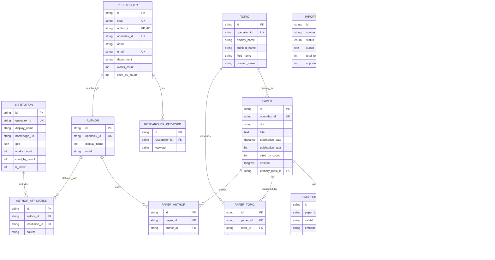

### 7.3 Why Researcher and Author are separate

`Researcher` belongs to the portal domain. It stores a curated profile, slug, email, appointment, department, biography, and UI links.

`Author` belongs to the bibliographic domain. It stores the canonical OpenAlex scholarly identity used in paper authorships.

The publication path is:

```text
Researcher.authorId
  -> Author.id
  -> PaperAuthor.authorId
  -> PaperAuthor.paperId
  -> Paper.id
```

This separation allows the database to retain hundreds of thousands of co-authors without pretending each one is a curated UIUC researcher. `Researcher.openalexId` remains for transitional compatibility, but application relations use `Researcher.authorId`.

## 8. OpenAlex data acquisition

### 8.1 Institution synchronization

The institution record is synchronized independently from papers and researchers.

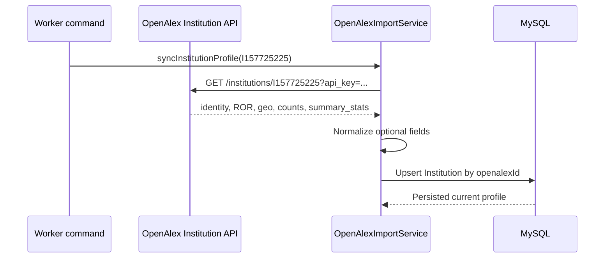

Run it directly with:

```bash
pnpm --filter worker sync:institution
```

`import:phase2` also invokes the institution sync. The API `InstitutionService` contains a stable fallback for identity/location so chat and the public institution endpoint remain useful if the row is temporarily absent.

### 8.2 End-to-end researcher and paper ingestion

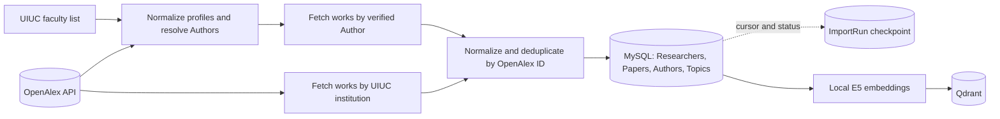

### 8.3 OpenAlex client behavior

- `OPENALEX_API_KEY` is sent as the `api_key` query parameter.
- `mailto` and a descriptive user agent identify the application.
- Cursor pagination avoids page-number depth limits.
- Page size is capped at 100.
- HTTP 429 and 5xx responses use bounded retry/backoff.
- A long `Retry-After` or exhausted daily budget stops the job rather than busy-looping.
- The current cursor and totals are saved in `ImportRun`.
- Singletons and filtered list queries are preferred over repeated remote search when an ID is already known.

## 9. Researcher identity resolution

### 9.1 Resolution flow

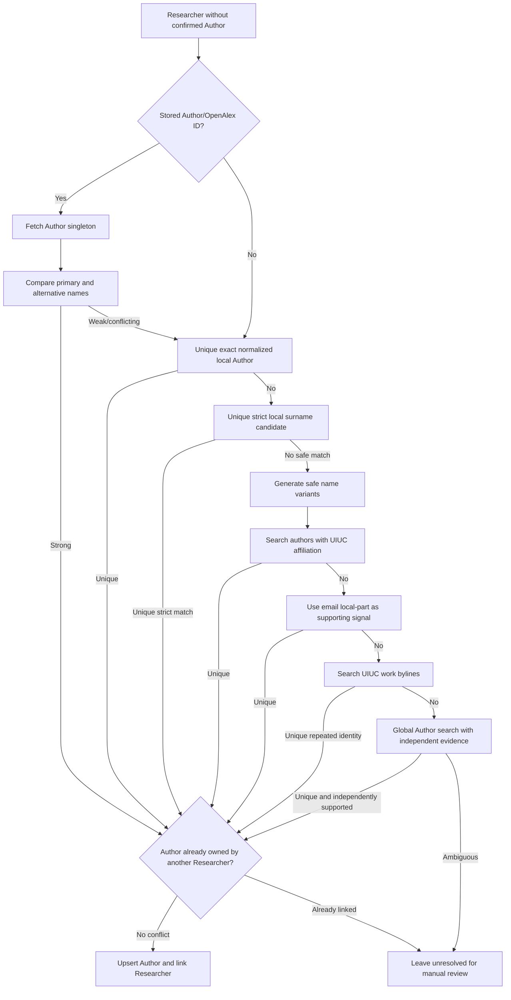

### 9.2 Name normalization rules

1. Normalize Unicode with NFKD and remove diacritic differences for comparison.
2. Remove honorifics such as `Dr` and `Prof`.
3. Normalize punctuation and repeated whitespace.
4. Prefer exact normalized full-name matches.
5. Accept reordered identical token sets.
6. Treat a full middle name and the same initial as compatible.
7. Allow omitted middle names only with uniqueness or supporting evidence.
8. Reject explicit conflicting middle initials.
9. Use email local-part similarity only as supporting evidence.
10. Reject tied top candidates instead of guessing.

The resolver can handle forms such as `Amy Jaye Wagoner Johnson` versus `Amy J. Wagoner Johnson`, and `Theresa Ann Saxton-Fox` versus `Theresa Saxton-Fox`. It cannot guarantee a 100% automatic match rate without authoritative ORCID or institutional directory identifiers.

## 10. Complete paper reconciliation

For each linked Author, the backfill job scans the full OpenAlex work set rather than trusting a previously stored count.

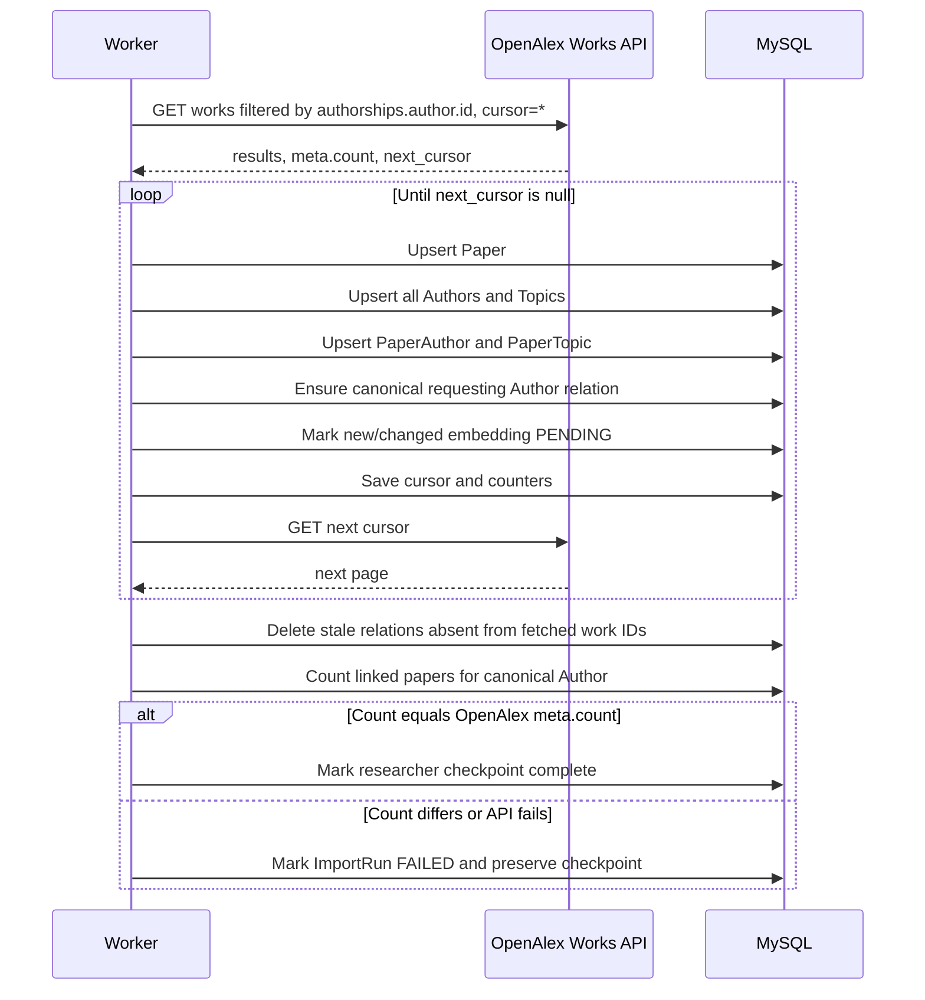

Only the stale `PaperAuthor` relation is removed. A `Paper` remains when other authors or application records still reference it.

## 11. Vector synchronization

### 11.1 Queue and ledger lifecycle

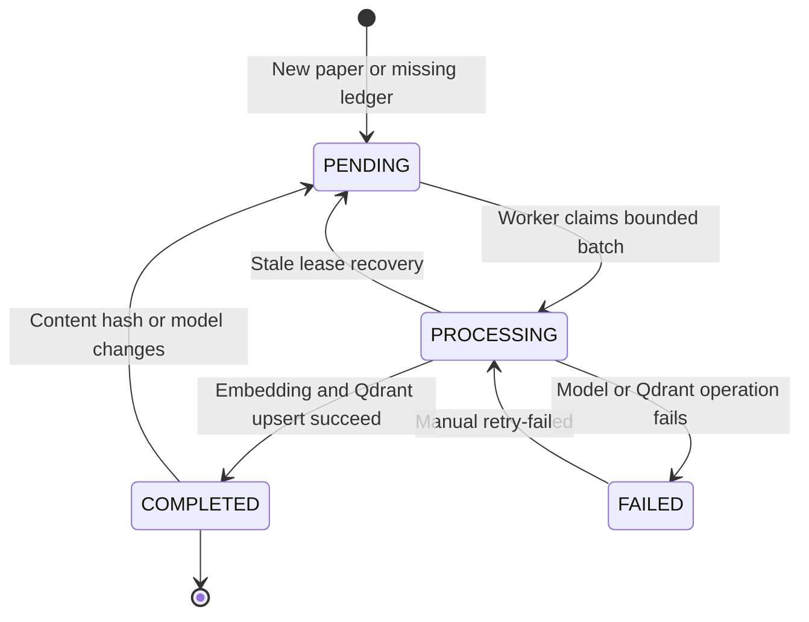

### 11.2 Embedded content

The document embedding input is:

```text
Title: <paper title>
Primary topic: <topic display name>
Abstract: <abstract or empty text>
```

The content is capped and hashed with SHA-256. Changes to title, primary topic, abstract, model, or embedding version return a completed row to `PENDING`.

### 11.3 Model and collection contract

| Setting         | Value                          |
| --------------- | ------------------------------ |
| Model           | `Xenova/multilingual-e5-small` |
| Dimensions      | 384                            |
| Distance        | Cosine                         |
| Collection      | `uiuc_papers_e5_v1`            |
| Point ID        | Local Paper UUID               |
| Query prefix    | E5 query mode                  |
| Document prefix | E5 passage/document mode       |

Each point payload contains paper identity, title, abstract, publication year, citation count, DOI/landing URL, primary topic, and author names.

### 11.4 Polling behavior

- Long-running worker mode starts a sync immediately.
- Default poll interval is 60 seconds through `VECTOR_SYNC_INTERVAL_MS`.
- Minimum interval is 10 seconds.
- Default batch size is 50; the hard maximum is 200.
- A process-level lock prevents overlapping polls.
- Stale `PROCESSING` rows return to `PENDING`.
- `--retry-failed` includes failed records during manual draining.
- Completed rows created by another embedding model are re-queued.

## 12. Chat and LLM architecture

### 12.1 Processing model

The current flow is:

```text
Message
  -> Intent Classification and Entity Extraction
  -> Deterministic Tool Selection
  -> Allowlisted Tool Execution
  -> Evidence and Fact Merge
  -> Response Generation
  -> SSE Delivery and Persistence
```

This is an internal tool layer, not unrestricted provider function calling. The classification model cannot submit SQL, choose an arbitrary service, or execute code. It returns validated JSON from a closed schema. Application code maps that schema to allowlisted tools.

### 12.2 Retrieval routes

| Route         | Meaning                                                                 |
| ------------- | ----------------------------------------------------------------------- |
| `STRUCTURED`  | MySQL counts, profiles, metadata, rankings, filters, and trends         |
| `SEMANTIC`    | Qdrant similarity search over paper embeddings                          |
| `HYBRID`      | Both structured facts and semantic paper evidence                       |
| `UNSUPPORTED` | Question is outside UIUC researcher/publication/topic/institution scope |

### 12.3 Intent families

| Family      | Examples                                                                                                              |
| ----------- | --------------------------------------------------------------------------------------------------------------------- |
| Researcher  | Profile, contact, affiliation, research areas, work/citation counts, publications, coauthors, yearly activity         |
| Paper       | Details, summary, authors, citations, topics, links, and related papers                                               |
| Topic       | Overview, papers, researchers, and topic trends                                                                       |
| Department  | Overview, researchers, publications, and trends                                                                       |
| Institution | Identity, location, overview, main research areas, totals, growth areas, top/recent publications, and top researchers |
| Discovery   | Semantic and hybrid publication discovery                                                                             |

`INSTITUTION_RESEARCH_AREAS` and `RESEARCH_TRENDS` are intentionally distinct:

- main research areas are ranked by locally indexed primary-topic field volume;
- growing areas compare publication counts between time windows.

### 12.4 Allowlisted tools

| Tool                                   | Data source               | Purpose                                                    |
| -------------------------------------- | ------------------------- | ---------------------------------------------------------- |
| `get_researcher_profile`               | MySQL                     | Profile, contact, affiliation, metrics, and inferred areas |
| `count_researcher_publications`        | MySQL                     | Exact Author-linked counts with optional filters           |
| `list_researcher_publications`         | MySQL                     | Latest, oldest, recent, or most-cited papers               |
| `analyze_research_trends`              | MySQL                     | Institution-wide primary-topic growth                      |
| `list_top_publications`                | MySQL                     | Institution-wide top/recent works                          |
| `find_researchers_by_topic`            | MySQL                     | Researchers connected to a topic                           |
| `get_paper_details`                    | MySQL                     | Metadata, authors, citations, topics, and URLs             |
| `list_researcher_coauthors`            | MySQL                     | Frequent collaborators                                     |
| `analyze_researcher_publication_trend` | MySQL                     | Researcher output by year                                  |
| `get_institution_overview`             | MySQL and stable fallback | Identity, location, OpenAlex metrics, and local totals     |
| `get_institution_research_areas`       | MySQL                     | Leading fields by indexed publication volume               |
| `list_top_researchers`                 | MySQL                     | Productivity/citation rankings                             |
| `analyze_topic`                        | MySQL                     | Topic overview, papers, and trends                         |
| `analyze_department`                   | MySQL                     | Department people, papers, and yearly output               |
| `semantic_search_papers`               | Local E5 and Qdrant       | Conceptual paper retrieval                                 |

### 12.5 Detailed request sequence

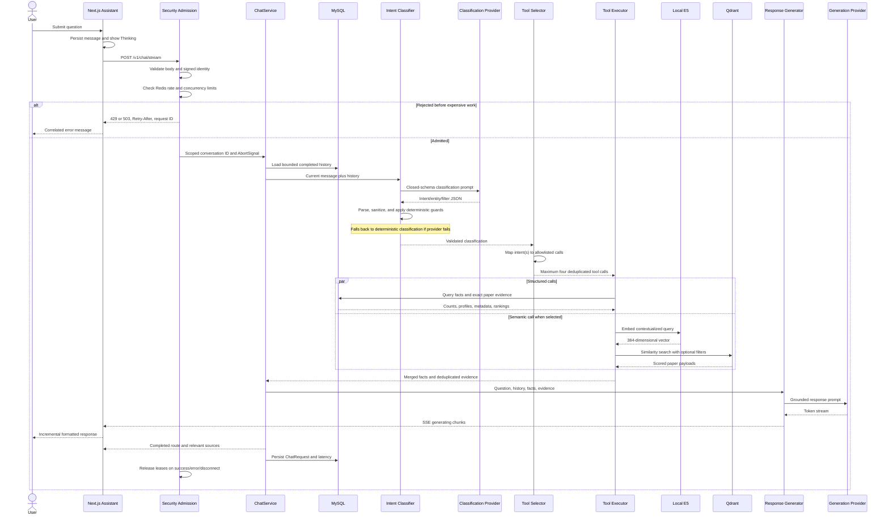

### 12.6 Evidence and source rules

- Database facts do not require fake paper citations.
- Paper citations are attached only when the generated answer references numbered evidence.
- A failed entity resolution returns no unrelated global papers.
- A structured institution answer can complete without paper evidence.
- Provider prompts distinguish “no paper evidence required” from “no evidence found”.
- Current facts override statements from prior conversation turns.

### 12.7 Conversation persistence

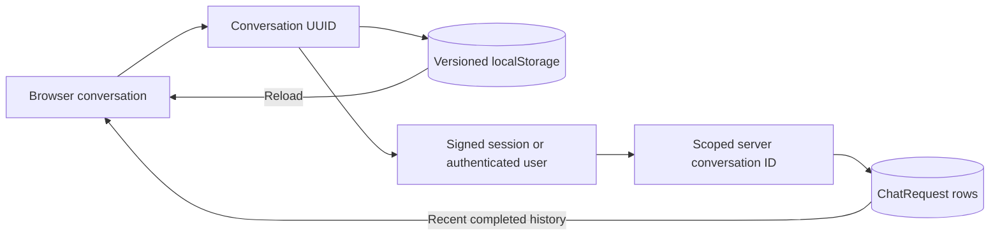

- The browser stores the UUID, messages, citations, and safe error metadata.
- Storage is bounded to the latest 50 messages, 20,000 characters per message, and 10 citations per message.
- Stored data is validated before rendering.
- An interrupted stream is restored as stopped, never as still generating.
- The API scopes a browser UUID to the signed session or authenticated user.
- The latest six completed server turns are used for reference resolution.
- Clearing chat deletes local history and creates a new UUID.

## 13. Provider credentials and fallback

### 13.1 Credential storage

- API keys are encrypted with AES-256-GCM.
- The encryption key is supplied outside the database.
- API responses expose only a short key hint.
- Admin endpoints require a separate admin token and can use an IP allowlist.
- Custom provider base URLs require HTTPS in production and must match the provider host allowlist.

### 13.2 Ordered fallback behavior

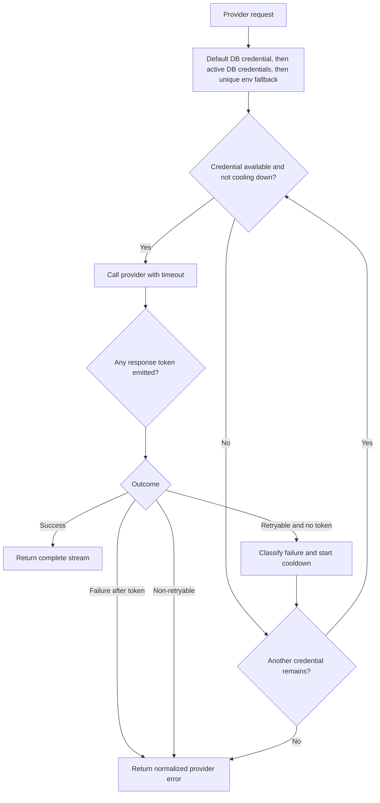

Fallback never switches providers after the first output token. This prevents one answer from being assembled from multiple models.

| Control                       |     Default |
| ----------------------------- | ----------: |
| Classification timeout        |  12 seconds |
| Overall chat timeout          |  60 seconds |
| Provider timeout              |  55 seconds |
| Authentication/quota cooldown | 600 seconds |
| Transient cooldown            |  30 seconds |
| Circuit-breaker threshold     |  5 failures |
| Circuit-breaker cooldown      |  30 seconds |

Provider cooldown and circuit-breaker state are currently process-local. A multi-replica production deployment should move this state to Redis.

## 14. Security, rate limiting, and traffic control

### 14.1 Admission pipeline

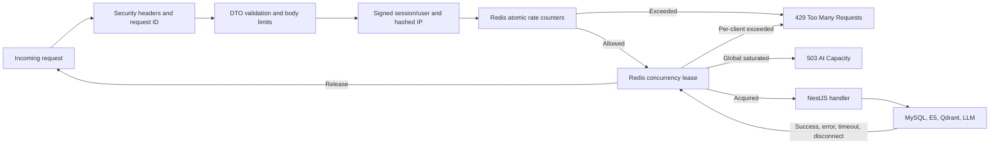

### 14.2 Default quotas

| Route class        |               Default | Tracking                          | Additional control                              |
| ------------------ | --------------------: | --------------------------------- | ----------------------------------------------- |
| Public reads       |            120/minute | Signed session/user and hashed IP | Short cache on aggregate endpoints              |
| Department lookup  |             30/minute | Signed session/user and hashed IP | Browser debounce and stale-request cancellation |
| Anonymous chat     |   5/minute and 30/day | Signed session plus hashed IP     | One active stream per session                   |
| Authenticated chat | 10/minute and 200/day | User plus hashed IP               | Two active streams per user                     |
| Admin credentials  |             10/minute | Admin identity and hashed IP      | Admin token and optional IP allowlist           |
| Global chat        |             20 active | Shared Redis lease                | Early 503 and `Retry-After`                     |

Redis Lua scripts make counter and lease changes atomic across API replicas. Production can fail closed when Redis is required; development may use a bounded process-local fallback.

### 14.3 HTTP and application controls

- Global validation transforms known fields, strips unknown fields, and rejects non-whitelisted input.
- Chat questions are non-empty and capped at 2,000 characters.
- Request bodies are bounded.
- CORS uses exact allowed origins.
- Proxy trust must be an explicit hop count or subnet in production.
- `X-Powered-By` is disabled.
- HSTS is enabled in production.
- Responses include request IDs and restrictive security headers.
- Anonymous sessions use an HMAC-SHA256 signed, `HttpOnly`, `SameSite=Lax` cookie.
- Cookie signature comparisons and admin-token comparisons are timing-safe.
- IP addresses and user identifiers are hashed before Redis key construction.
- Browser disconnect and timeout AbortSignals propagate to provider calls.
- Retrieved titles, abstracts, history, and metadata are treated as untrusted prompt content.

### 14.4 Infrastructure controls

- Local MySQL, Redis, Qdrant, Adminer, and Redis Commander bind to `127.0.0.1`.
- Admin tools require an optional Compose profile.
- Production data services should remain on a private network.
- Qdrant supports `QDRANT_API_KEY`.
- Production should add managed TLS, WAF/DDoS protection, bot controls, and coarse edge rate limits.

## 15. Caching and scaling

### 15.1 Public response cache

| Endpoint          |         TTL |
| ----------------- | ----------: |
| `/v1/institution` | 300 seconds |
| `/v1/stats`       |  60 seconds |
| `/v1/trends`      | 300 seconds |
| `/v1/topics`      | 300 seconds |

Redis is used in production. A development-only in-memory fallback is available. Responses expose `X-Cache: HIT` or `MISS`.

### 15.2 Horizontal scale

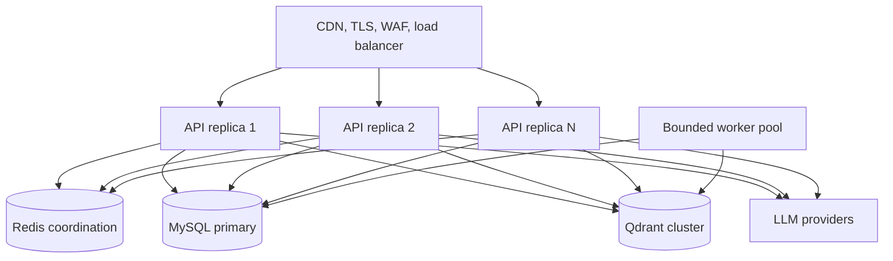

The API is mostly stateless because conversation data, rate counters, leases, and canonical records live outside the process. Remaining process-local provider breaker state should be externalized before aggressive horizontal scaling.

BullMQ dependencies are present, but OpenAlex imports and vector polling are currently CLI/in-process jobs. A production worker topology should use durable queues, bounded concurrency, retries, dead-letter handling, and monitoring.

## 16. Observability

Enable detailed local AI-flow tracing with:

```env
CHAT_TRACE_ENABLED=true
CHAT_TRACE_TOKENS=true
CHAT_TRACE_MAX_CHARS=100000
```

Important trace stages include:

| Trace family              | Contents                                                                  |
| ------------------------- | ------------------------------------------------------------------------- |
| `request.*`               | Request ID, transport, scoped conversation, failure stage, latency        |
| `conversation.*`          | Bounded prior turns and sources                                           |
| `intent_classification.*` | Input, prompt, raw JSON, validated result, fallback reason                |
| `tool_selection.*`        | Route and allowlisted calls                                               |
| `tools.*`                 | Call arguments, structured facts, evidence counts, merged result          |
| `entity_resolution.*`     | Candidate names, scores, ambiguity, selected Author                       |
| `database.*`              | Query filters and returned structured records                             |
| `vector.*`                | Query, model, dimensions, Qdrant request/response, mapped evidence        |
| `provider.*`              | Credential order, provider/model attempt, cooldown, and selected provider |
| `response_generation.*`   | Grounded prompt, optional tokens, final response                          |
| `persistence.*`           | Saved `ChatRequest` metadata                                              |

Trace sanitization redacts key-like strings, authorization headers, tokens, passwords, encryption fields, and secrets. Full trace mode can still contain personal or unpublished research data and must remain disabled in production.

## 17. Operational commands

### 17.1 Infrastructure and schema

```bash
pnpm docker:up
pnpm db:generate
pnpm db:push
```

The current local database was historically managed with `db push`. It must be baselined before relying on `prisma migrate deploy` in an existing environment.

### 17.2 Institution and researchers

```bash
# Refresh current UIUC identity and metrics from OpenAlex.
pnpm --filter worker sync:institution

# Resolve only researchers missing authorId.
pnpm --filter worker link:researcher-authors

# Reconcile author-level counts.
pnpm --filter worker sync:researcher-metrics

# Infer missing departments from available profile/topic evidence.
pnpm --filter worker backfill:researcher-departments
```

### 17.3 Researcher papers

```bash
# Resume the latest checkpoint.
pnpm --filter worker backfill:researcher-papers

# Start the complete scan again.
pnpm --filter worker backfill:researcher-papers -- --restart

# Repair one Researcher UUID.
pnpm --filter worker backfill:researcher-papers -- --researcher-id=<uuid> --restart
```

### 17.4 Vector synchronization

```bash
# Drain pending rows.
pnpm --filter worker sync:vectors

# Include failed rows.
pnpm --filter worker sync:vectors -- --retry-failed --batch-size=50

# Start long-running scheduled polling.
pnpm --filter worker dev
```

## 18. Data integrity invariants

| Invariant                             | Enforcement                                                                             |
| ------------------------------------- | --------------------------------------------------------------------------------------- |
| One canonical row per OpenAlex entity | Unique OpenAlex ID and idempotent upsert                                                |
| One Author per Researcher             | Unique nullable `Researcher.authorId`                                                   |
| No duplicate authorship               | Unique `(paperId, authorId)`                                                            |
| No duplicate topic assignment         | Unique `(paperId, topicId)`                                                             |
| Safe researcher identity              | Confidence scoring, tie rejection, middle-name conflict rejection, and collision checks |
| Complete processed publication set    | Full cursor scan, stale-relation removal, exact `meta.count` verification               |
| Current institution profile           | Explicit institution sync and API fallback                                              |
| Vector matches source content         | Content hash plus model/version fields                                                  |
| Interrupted embedding recovers        | Stale `PROCESSING` rows return to `PENDING`                                             |
| Completed ledger equals Qdrant points | Operational count verification                                                          |
| No unrelated chat sources             | Sources selected only from evidence referenced by the response                          |
| MySQL remains canonical               | Qdrant can be deleted and rebuilt without losing research metadata                      |

## 19. Known limitations and next steps

| Area                    | Current limitation                                           | Next step                                                    |
| ----------------------- | ------------------------------------------------------------ | ------------------------------------------------------------ |
| Researcher identity     | 11 profiles remain without a safe Author match               | Manual review or authoritative ORCID/directory mapping       |
| Paper reconciliation    | Latest full job failed on OpenAlex HTTP 429                  | Resume the stored checkpoint with available API budget       |
| Vector completion       | 6,330 records remain pending                                 | Keep the worker running until the ledger drains              |
| Durable work scheduling | Imports and vector polling are not fully BullMQ-backed       | Move jobs to queues with retry and dead-letter policies      |
| Provider breaker state  | Cooldown/circuit state is local to one API process           | Store shared breaker state in Redis                          |
| End-user authentication | Research portal does not yet enforce institutional SSO       | Add OIDC/SSO and role-based authorization                    |
| Edge protection         | CDN/WAF configuration is outside this repository             | Deploy behind managed edge protection                        |
| Migration history       | Existing local schema was not created entirely by migrations | Baseline before production migration deployment              |
| Secret exposure         | Development keys were shared interactively                   | Rotate them and store replacements only in secret management |

## 20. Completion criteria

The data layer should be described as fully synchronized only when:

1. every automatically resolvable Researcher has a verified Author link;
2. every remaining unresolved identity has an explicit manual-review outcome;
3. the full researcher-paper job finishes with a `COMPLETED` `ImportRun`;
4. every processed Author has an exact local/OpenAlex work count;
5. no unexpected embedding rows remain `PENDING`, `PROCESSING`, or `FAILED`;
6. Qdrant point count equals completed embedding rows;
7. structured, semantic, hybrid, and conversational follow-up tests pass;
8. production secrets are rotated and external security controls are deployed.

At the snapshot in this document, Qdrant and the completed embedding ledger agree, but conditions 1 through 5 are not all complete.

## 21. External references

- [OpenAlex API documentation](https://docs.openalex.org/)
- [OpenAlex authentication](https://docs.openalex.org/how-to-use-the-api/rate-limits-and-authentication)
- [Qdrant documentation](https://qdrant.tech/documentation/)
- [Prisma documentation](https://www.prisma.io/docs)
- [NestJS documentation](https://docs.nestjs.com/)
- [TanStack Query documentation](https://tanstack.com/query/latest)
