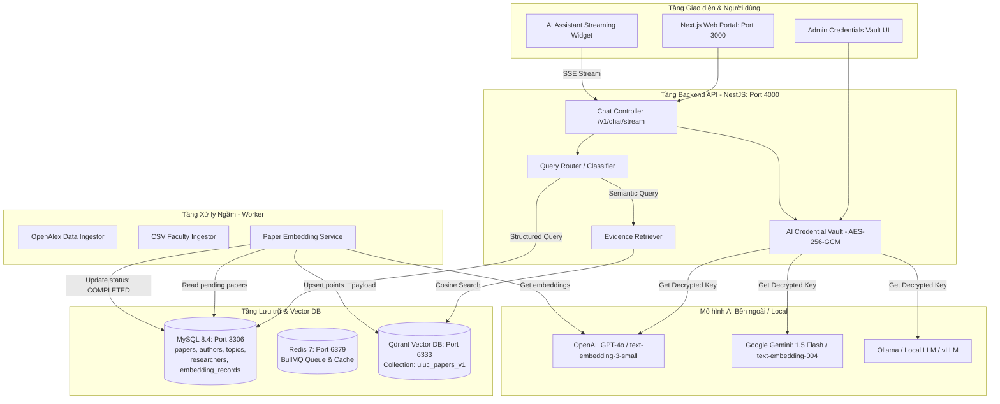
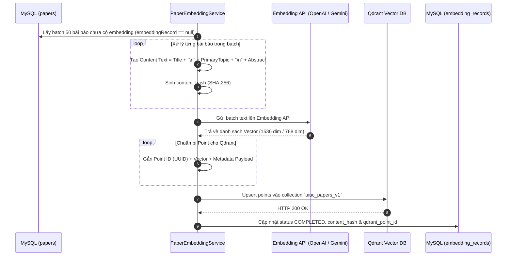

# UIUC Research Portal - Kế hoạch Triển khai Vector Data & AI Assistant (plan.md)

Tài liệu này mô hình hóa toàn bộ kiến trúc và quy trình triển khai cho **Giai đoạn 3 (Vector Data & Qdrant)** và **Giai đoạn 4 (LLM Integration, RAG Pipeline & AI Assistant Chat)**.

---

## 1. Sơ đồ Kiến trúc Tổng thể Hệ thống



---

## 2. Mô hình Vector Data Pipeline với Qdrant (Phase 3)

### 2.1. Quy trình Xử lý & Đồng bộ Vector (Vectorization Flow)



### 2.2. Cấu trúc Payload của một Point trong Qdrant

```json
{
  "id": "e4f8b2d1-419b-43ac-93d1-72f88bca9012",
  "vector": [0.0124, -0.0432, 0.0891, "...(1536 chiều)..."],
  "payload": {
    "paperId": "p-12345",
    "openalexId": "https://openalex.org/W4391234567",
    "title": "Optimizing Massive Scale Memory Consistency for Heterogeneous AI Accelerators",
    "publicationYear": 2025,
    "citedByCount": 142,
    "doi": "https://doi.org/10.1145/3613904.3642100",
    "primaryTopic": "Parallel Computing and Architecture",
    "authors": ["Brad Sutton", "Minh N Do"]
  }
}
```

---

## 3. Mô hình Triển khai LLM & Trợ lý Ảo (Phase 4)

### 3.1. Luồng Phân loại Câu hỏi & RAG (Retrieval-Augmented Generation)

```mermaid
flowchart TD
    Start([Người dùng gửi câu hỏi qua Chat Widget]) --> RouteCheck{Bộ phân loại Intent<br/>Query Classifier}

    %% Nhánh Structured
    RouteCheck -->|Thống kê, số lượng, xếp hạng<br/>'Top papers', 'How many'| R_Structured[Structured Route]
    R_Structured --> SQL_Query[Truy vấn SQL trực tiếp MySQL<br/>COUNT / ORDER BY cited_by_count]
    SQL_Query --> Evidence_Pack[Đóng gói Evidence Data]

    %% Nhánh Semantic
    RouteCheck -->|Khái niệm, chủ đề khoa học<br/>'Photosynthesis in crops', 'Quantum AI'| R_Semantic[Semantic Route]
    R_Semantic --> Embed_Query[Embed câu hỏi thành vector]
    Embed_Query --> Qdrant_Search[Qdrant Cosine Similarity Search<br/>Top K = 3-5 bài báo gần nhất]
    Qdrant_Search --> Evidence_Pack

    %% Nhánh Hybrid
    RouteCheck -->|Kết hợp tìm chủ đề + điều kiện lọc<br/>'Nghiên cứu AI của năm 2025'| R_Hybrid[Hybrid Route]
    R_Hybrid --> Qdrant_Filter[Qdrant Search kèm Payload Filter<br/>filter: publicationYear >= 2025]
    Qdrant_Filter --> Evidence_Pack

    %% Nhánh Unsupported
    RouteCheck -->|Spam, câu hỏi quá ngắn, ngoài lề| R_Unsupported[Unsupported Route]
    R_Unsupported --> Reject_Msg[Trả về thông báo từ chối lịch sự]

    %% Tổng hợp ngữ cảnh & LLM
    Evidence_Pack --> Context_Assembly[Tạo Grounded System Prompt<br/>Bắt buộc LLM chỉ dùng tài liệu này]
    Context_Assembly --> Key_Fetch[Lấy API Key đã giải mã từ Vault]
    Key_Fetch --> LLM_Call[Gọi LLM Streaming: Gemini / OpenAI / Ollama]
    LLM_Call --> SSE_Stream[Bắn từng token qua SSE về Web]
    SSE_Stream --> Citations_Badge[Web UI hiển thị câu trả lời<br/>kèm thẻ trích dẫn [1], [2] có link DOI]
```

---

### 3.2. Cấu trúc Prompt RAG Chống Ảo Giác (Anti-Hallucination)

```text
================================== SYSTEM PROMPT ==================================
Bạn là Trợ lý Nghiên cứu Khoa học của Đại học Illinois (UIUC Research Assistant).
Nhiệm vụ của bạn là giải đáp câu hỏi của người dùng dựa TRÊN CÁC BẰNG CHỨNG ĐƯỢC CUNG CẤP.

QUY TẮC BẮT BUỘC:
1. CHỈ sử dụng thông tin trong mục [DANH SÁCH BẰNG CHỨNG]. Không được tự suy diễn hoặc dùng kiến thức bên ngoài.
2. Mọi thông tin đưa ra phải được đánh số trích dẫn tương ứng: [1], [2], [3].
3. Nếu các bài báo được cung cấp không đủ thông tin để trả lời câu hỏi, hãy nói rõ:
   "Dựa trên các ấn phẩm nghiên cứu hiện có của UIUC, không có đủ bằng chứng để trả lời vấn đề này."
4. Câu trả lời cần súc tích, mang văn phong khoa học chuẩn mực.

[DANH SÁCH BẰNG CHỨNG]:
[1] Tiêu đề: "Engineering Enhanced Photosynthetic Pathways for Climate Resilience" (2024)
    Tác giả: Carl Bernacchi et al. | Trích dẫn: 142 | DOI: https://doi.org/10.1126/science.ade4502
    Tóm tắt: Nghiên cứu tối ưu hóa hiệu suất quang hợp của cây đậu tương biến đổi gen...

[2] Tiêu đề: "Optimizing Massive Scale Memory Consistency for Heterogeneous AI Accelerators" (2025)
    Tác giả: Brad Sutton, Minh N Do | Trích dẫn: 48 | DOI: https://doi.org/10.1145/3613904.3642100
    Tóm tắt: Mô hình nhất quán bộ nhớ giảm độ trễ 37% trên các kiến trúc tăng tốc GPU-NPU...
===================================================================================
CÂU HỎI CỦA NGƯỜI DÙNG: {query}
```

---

## 4. Bảng So sánh Các Tuyến Truy vấn (Query Routing Matrix)

| Tuyến (Route) | Dấu hiệu nhận biết câu hỏi | Nguồn dữ liệu | Độ trễ ước tính | Rủi ro ảo giác |
| :--- | :--- | :--- | :--- | :--- |
| **`STRUCTURED`** | "Bao nhiêu bài?", "Top trích dẫn", "Năm nào nhiều nhất?" | MySQL (Index scan) | ~10 - 30ms | **0%** (Số liệu SQL tuyệt đối) |
| **`SEMANTIC`** | "Nghiên cứu về...", "Công nghệ nào áp dụng...", "Giải thích..." | Qdrant (HNSW Vector Search) | ~50 - 100ms | Rất thấp (Grounded theo Top K) |
| **`HYBRID`** | "Nghiên cứu AI năm 2025", "Giảng viên khoa Điện tử viết gì..." | Qdrant + Payload Filter | ~60 - 120ms | Rất thấp |
| **`UNSUPPORTED`** | Dưới 4 ký tự, hỏi thời tiết, toán học cơ bản, spam | Trả về template trực tiếp | ~5ms | Không có |

---

## 5. Kế hoạch Các Bước Triển khai Kế tiếp

### Bước 1: Qdrant Client & Service
- Thêm thư viện `@qdrant/js-client-rest` vào workspace.
- Tạo service khởi tạo collection `uiuc_papers_v1` (distance: `Cosine`, size: `1536` hoặc `768`).

### Bước 2: Kích hoạt Embedding Pipeline (Worker)
- Cập nhật [`PaperEmbeddingService`](file:///Users/levanduc/Project/research-portal/apps/worker/src/jobs/paper-embedding/paper-embedding.service.ts) để gọi API embedding (OpenAI `text-embedding-3-small` hoặc Gemini `text-embedding-004`).
- Chạy batch đẩy toàn bộ 35.854 papers vào Qdrant.

### Bước 3: Nối Qdrant vào Chat Service
- Cập nhật [`ChatService.retrieveEvidence`](file:///Users/levanduc/Project/research-portal/apps/api/src/modules/chat/chat.service.ts#L80) để thực hiện vector search thực tế thay vì query `LIKE %keyword%`.

### Bước 4: Kiểm thử Trực quan (End-to-End Test)
- Mở Web giao diện [http://localhost:3000](http://localhost:3000), mở AI Assistant widget.
- Đặt câu hỏi ngữ nghĩa bất kỳ và kiểm tra phản hồi streaming kèm thẻ trích dẫn bài báo thực tế.
